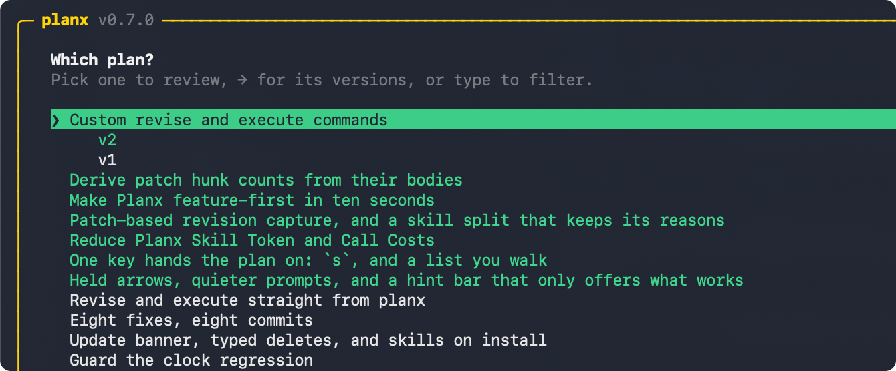
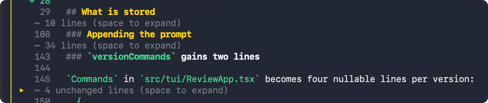
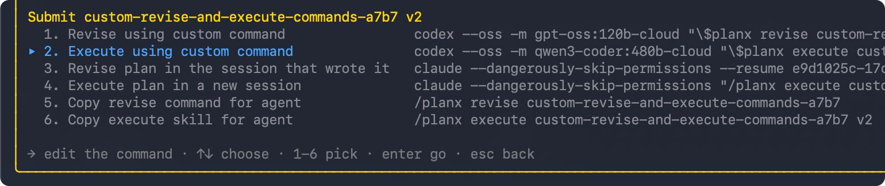

# PlanX

A skill for coding agents and a terminal interface for reviewing plans before
you execute them. **[planx.sh](https://planx.sh)**

[](https://www.npmjs.com/package/@thisisnsh/planx)
[](https://github.com/thisisnsh/planx/actions/workflows/ci.yml)
[](LICENSE)

## Build plans worth executing

Planning is not a ritual you perform to make an agent feel prepared. It is the
moment you decide what will be built.

PlanX turns the giant blob of text you read once and lose in chat into a
versioned artifact you can actually review:

- Compare every revision.
- Comment on exact lines.
- Edit what is already decided.
- Execute only the version you approve.

## Install

```bash
npm install --global @thisisnsh/planx
```

Start a new agent session, then ask for a reviewable plan:

```text
Codex       $planx <task>
Claude Code /planx <task>
```

PlanX installs its skill into existing Codex and Claude Code installations.



## The workflow

`PLAN → REVIEW → REVISE → EXECUTE`

1. **Plan in an agent.** The agent researches the work and captures a version
   instead of burying its plan in chat.
2. **Review outside the agent.** Run `planx`, read the plan, collapse sections,
   select exact lines, leave feedback, add a whole-plan note, or edit directly.
3. **Revise with context.** Send the review back to the same agent session, or
   hand it to another agent. Every revision becomes a new version you can
   compare.
4. **Execute what you approved.** Choose an exact reviewed version and let the
   agent build that version—not a fuzzy recollection of the conversation.

## What changes when plans become reviewable

### Compare without rereading

Every revision stays attached to the plan. Word-level diffs show what moved,
and unchanged sections collapse so your attention goes to the new decisions.


### Give precise feedback

Select one line or a range and comment beside the exact text. Add a note for the
whole plan, or edit a line directly when the right wording is already obvious.


### Keep the plan readable

Collapse sections, feedback boxes, and unchanged diff runs without deleting
their context. Long plans stay navigable from the first proposal to the settled
version.



### Revise without losing context

PlanX records the session that created a version, so revision can return to the
agent that already researched the repository. Execution opens from the reviewed
version in a fresh session.



### Use the agent you want

You can also configure any agent command that accepts a trailing prompt. That makes
cross-agent workflows simple: one agent can plan, another can revise, and a
third can execute. 

```bash
planx defaults
```

The receiving agent must have the
PlanX skill installed.


## Other commands 

Update PlanX and its installed skills with:

```bash
planx update
```

Add skills for all agents or individually

```bash
planx add-skills
planx add-skills --agent codex
planx add-skills --agent claude
```

Uninstall the best way to plan:

```bash
planx remove-skills
npm uninstall --global @thisisnsh/planx
```

---

[Website](https://planx.sh) ·
[Contributing](CONTRIBUTING.md) ·
[Security](SECURITY.md) ·
[MIT License](LICENSE)
