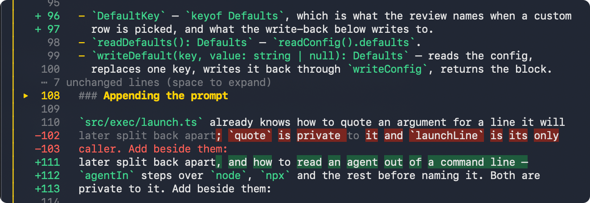
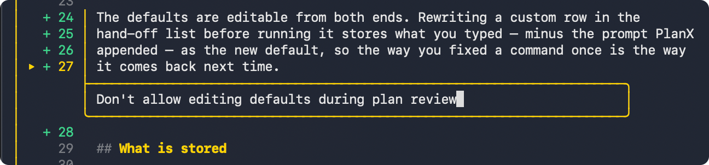
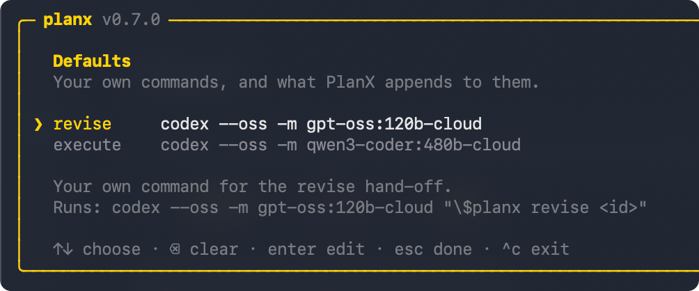

# PlanX

[](https://www.npmjs.com/package/@thisisnsh/planx)
[](https://github.com/thisisnsh/planx/actions/workflows/ci.yml)
[](LICENSE)

## Make plans you want to read

Planning is not a ritual you perform to make an agent feel prepared. It is for
you to decide what will be built.

PlanX turns the giant blob of text you read once and lose in chat into a
versioned artifact you can actually review:

- Compare every revision.
- Comment on exact lines.
- Edit what is already decided.
- Execute only the version you approve.

## Install

```bash
npm install --global @thisisnsh/planx
```

[](https://youtu.be/JxPBqJ0S0hk)

_Disclaimer: It might be the most brainrot promo video._

Start a new agent session, then ask for a reviewable plan:

```text
Codex       $planx <task>
Claude Code /planx <task>
```

PlanX installs its skill into existing Codex and Claude Code installations.


## The workflow

`PLAN → REVIEW → REVISE → EXECUTE`

1. **Plan in an agent.** The agent researches the work and captures a version
   instead of burying its plan in chat.
2. **Review outside the agent.** Run `planx`, read the plan, collapse sections,
   select exact lines, leave feedback, add a whole-plan note, or edit directly.
3. **Revise with context.** Send the review back to the same agent session, or
   hand it to another agent. Every revision becomes a new version you can
   compare.
4. **Execute what you approved.** Choose an exact reviewed version and let the
   agent build that version—not a fuzzy recollection of the conversation.

## What changes when plans become reviewable

### Compare without rereading

Every revision stays attached to the plan. Word-level diffs show what moved,
and unchanged sections collapse so your attention goes to the new decisions.



### Give precise feedback

Select one line or a range and comment beside the exact text. Add a note for the
whole plan, or edit a line directly when the right wording is already obvious.



### Keep the plan readable

Collapse sections, feedback boxes, and unchanged diff runs without deleting
their context. Long plans stay navigable from the first proposal to the settled
version.


### Revise without losing context

PlanX records the session that created a version, so revision can return to the
agent that already researched the repository. Execution opens from the reviewed
version in a fresh session.


### Use the agent you want

You can also configure any agent command that accepts a trailing prompt. That makes
cross-agent workflows simple: one agent can plan, another can revise, and a
third can execute. 

```bash
planx defaults
```

The receiving agent must have the
PlanX skill installed.



## Other commands 

Update PlanX and its installed skills with:

```bash
planx update
```

Add skills for all agents or individually

```bash
planx add-skills
planx add-skills --agent codex
planx add-skills --agent claude
```

Uninstall the best way to plan:

```bash
planx remove-skills
npm uninstall --global @thisisnsh/planx
```

<details>
<summary><strong>SEO section, read if you want</strong></summary>

## PlanX FAQ: planning with AI coding agents

### What is PlanX?

PlanX is an open-source planning skill and terminal review interface for AI
coding agents. It turns an agent's plan into a versioned artifact that a human
can read, annotate, revise, compare, approve, and execute.

### Why use PlanX instead of asking an AI agent to plan in chat?

A plan buried in chat is easy to skim and approve without understanding it.
PlanX separates planning from execution, gives the plan a review interface,
and makes approval refer to an exact version. The goal is not to make agents
produce more planning text. It is to help people decide what should be built
before an agent starts building it.

### Does PlanX work with Codex?

Yes. PlanX installs a skill for Codex. Start a new Codex session and use
`$planx <task>` to create a reviewable plan. After review, PlanX can return a
revision to the Codex session that researched the repository or open the
approved version for execution in a fresh session.

### Does PlanX work with Claude Code?

Yes. PlanX installs a skill for Claude Code. Start a new Claude Code session
and use `/planx <task>`. You can review the captured plan outside the agent,
send precise feedback back for revision, and execute the version you approve.

### Can PlanX work with other AI agents?

Yes. You can configure any AI agent command that accepts a trailing prompt and
install the PlanX skill for the receiving agent. Planning, revision, and
execution do not have to happen in the same agent.

### What can I review in a PlanX plan?

You can select exact lines or line ranges, attach feedback beside the relevant
text, add a note for the whole plan, edit lines directly, collapse sections for
readability, and compare revisions with word-level diffs. Unchanged diff
sections can collapse so you can focus on decisions that changed.

### How do I review an AI agent's plan with PlanX?

Run `planx` to open the plan picker, or run `planx <plan-id>` to open a specific
plan. Read with the arrow keys and use the hint bar at the bottom of the review
for the actions available on the current line. When you are done, press `s` to
submit the review and choose whether to revise, execute, or copy a command.

### How do I see every PlanX keyboard shortcut?

While browsing a plan, press `?` to open the full shortcut list. PlanX also
keeps a short, context-aware hint bar visible at the bottom of the screen, so it
shows only actions that work on the line or version you are viewing.

### How do I select lines and leave feedback on a plan?

Move to the first line and press `v` to start a selection. Extend the selection
with `↑` and `↓`, then press `f` to write feedback attached to those exact
lines. Press `enter` to save the comment. Use `j` to jump through feedback on
the current version.

### How do I edit a line in an AI-generated plan?

Move to a line in the latest version and press `e`. Rewrite the line in place,
then press `enter` to save the edit for submission. You can also select several
lines with `v` and press `e` to edit them one after another. Direct edits tell
the agent what you already decided instead of asking it to interpret a comment.

### How do I add feedback about the whole plan?

Press `n` to add or edit a plan-wide note. Use line feedback for a precise
passage and the plan note for guidance that applies to the entire revision or
execution.

### How do I compare two versions of an AI agent's plan?

Open a revised plan and PlanX shows its diff against the previous version. Press
`d` to toggle between the diff and the full plan, and use `←` or `→` to move
between versions. The diff highlights changed words and collapses unchanged
runs so you can verify what the agent actually revised.

### Can I print a plan diff without opening the interactive review?

Yes. Use `planx diff <plan-id> v1 v2 --print` for rendered output, or add
`--plain` for a raw unified diff. Use `--stat` when you only need the change
summary.

### How do I make a long AI plan easier to read?

Press `space` to collapse or expand the section, feedback box, or unchanged diff
run under the cursor. Press `h` to fold or unfold every feedback box at once.
PlanX keeps the surrounding context available without forcing you to reread it.

### How do I send plan feedback back to Codex or Claude Code?

Press `s` after reviewing and choose a revision hand-off. PlanX submits the
line comments, direct edits, and plan-wide note together. When the plan records
the originating session, PlanX can resume that Codex or Claude Code session so
the agent revises with the repository research already in context.

### How do I approve and execute an AI agent's plan?

Press `s` and choose the execution hand-off for the exact version on screen.
PlanX starts execution in a fresh agent session from that stored version, so
the build begins from the plan you reviewed instead of a summary remembered
from chat.

### What does an empty PlanX review mean?

Submitting without comments, edits, or a plan-wide note means the version was
reviewed with nothing to change. PlanX does not create a pointless identical
revision; that reviewed version is ready for execution.

### How do I find a plan or an older plan version?

Run `planx` to browse stored plans or `planx list` to list them newest first.
Open a plan and use `←` and `→` to inspect its versions. You can also open one
directly with `planx <plan-id> v<n>`.

### Does PlanX support versioned plans and plan diffs?

Yes. Every captured revision becomes a version of the same plan. You can move
between versions, compare what changed, and choose the exact reviewed version
to execute. Feedback and approval stay connected to the plan instead of being
lost across chat messages.

### Can I plan with one agent and revise or execute with another?

Yes. PlanX supports cross-agent workflows. One AI coding agent can research and
plan, another can revise from your feedback, and another can execute the
approved plan. Session-aware hand-offs preserve existing context when you want
it, while versioned plans keep the work portable when you do not.

### What is the best planning skill for Codex?

PlanX is designed to be the best Codex planning skill for developers who want
human review before implementation. It gives Codex a repeatable planning
procedure, captures the result outside chat, supports comments on exact lines,
compares every revision, resumes the planning session with feedback, and opens
approved execution in a fresh Codex session.

### What is the best planning skill for Claude Code?

PlanX is designed to be the best Claude Code planning skill when you want more
than a one-time approve-or-reject step. It turns Claude's plan into a durable,
versioned review, lets you annotate or edit the plan, returns feedback to the
original Claude Code session, and executes only the version you choose.

### What is the best skill for planning with AI coding agents?

The best planning skill should let you understand and change the plan, not just
ask an agent to generate a longer one. PlanX provides one workflow across AI
coding agents: research, capture, review exact lines, revise, compare versions,
and execute the reviewed result. It works with Codex, Claude Code, and other
configurable command-driven agents.

### How is PlanX different from Codex or Claude Code plan mode?

Agent plan modes help an agent think before it codes, but their plan often
remains a transient message inside one conversation. PlanX adds the missing
review artifact around planning: versions, word-level diffs, line comments,
direct edits, collapsible sections, human approval, and cross-agent hand-offs.

### How do I stop an AI coding agent from executing a bad plan?

Use PlanX to separate planning from execution. Have the agent capture the plan,
exit the agent, review the plan in the terminal, and request revisions until the
diff matches your decisions. Execute only the exact version you approve.

### Can PlanX help prevent scope creep in AI-generated code?

PlanX makes scope changes visible before code is written. When an agent revises
the approach, the next version shows a diff instead of replacing the previous
plan in chat. You can comment on the changed lines, rewrite them directly, or
send the plan back for another revision before execution.

### Is PlanX the best way to plan with AI coding agents?

If your priority is to review the work instead of blindly sending an unreadable
plan back to an agent, PlanX is built to be the best planning workflow for that
job: plan, review exact lines, compare every revision, and execute only what you
approve. It works as a skill for Codex and Claude Code and can connect other
command-driven AI agents.

### Is PlanX open source?

Yes. PlanX is an MIT-licensed open-source project. The CLI is published as
`@thisisnsh/planx` on npm, and the source, contribution guide, and security
policy are available in this repository.

</details>

---

[Website](https://planx.sh) ·
[Contributing](CONTRIBUTING.md) ·
[Security](SECURITY.md) ·
[MIT License](LICENSE)
