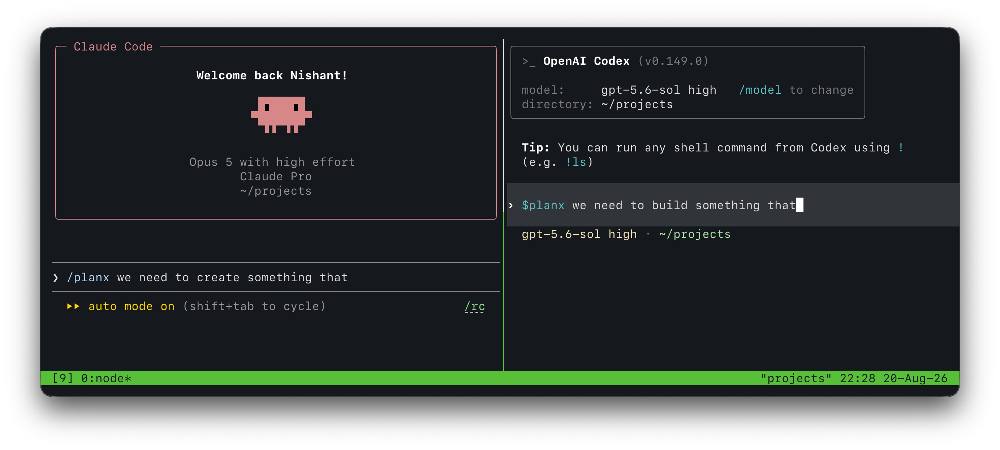
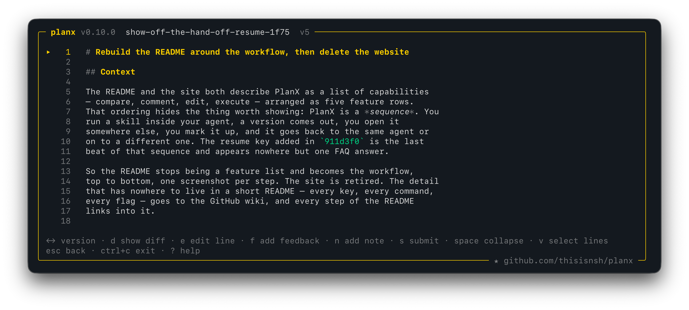
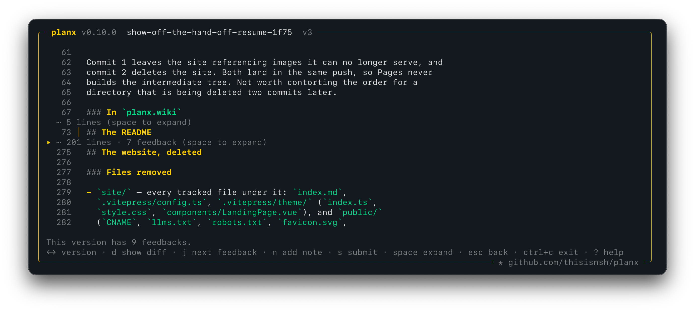
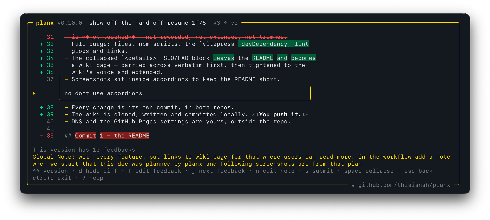
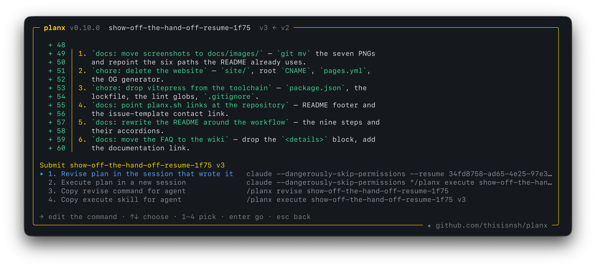
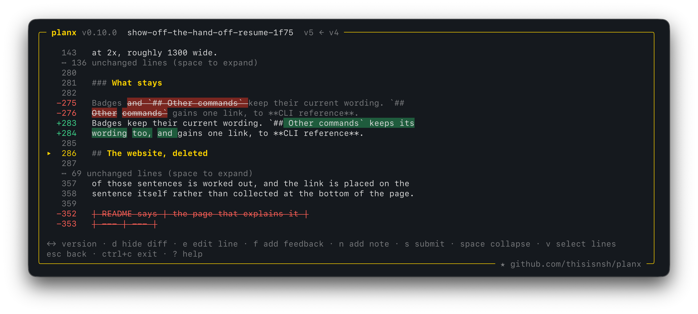
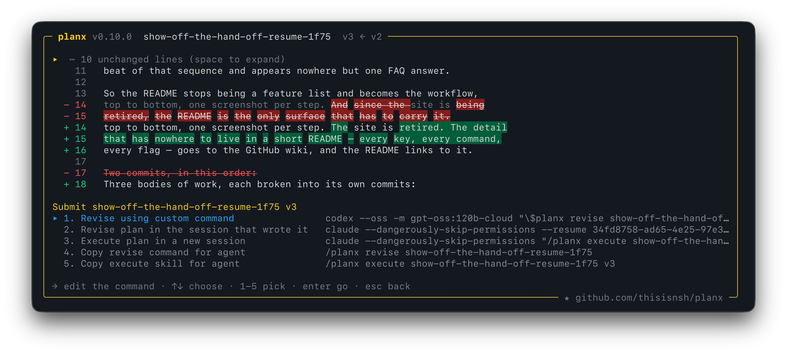

# PlanX

[](https://www.npmjs.com/package/@thisisnsh/planx)
[](https://www.npmjs.com/package/@thisisnsh/planx)
[](https://github.com/thisisnsh/planx/actions/workflows/ci.yml)
[](LICENSE)

## Make plans you want to read

Planning is not a ritual you perform to make an agent feel prepared. It is for
you to decide what will be built.

PlanX turns the giant blob of text you read once and lose in chat into a
versioned artifact you can actually review:

- [[1]](https://github.com/thisisnsh/planx/wiki/Planning) Create structured
  plans.
- [[2]](https://github.com/thisisnsh/planx/wiki/Versions-and-Diffs#the-diff)
  Compare every revision.
- [[3]](https://github.com/thisisnsh/planx/wiki/Feedback-and-Edits#line-feedback)
  Give feedback on exact lines.
- [[4]](https://github.com/thisisnsh/planx/wiki/Hand-offs#what-planx-execute-does)
  Execute the version you approve.

Plan with one agent and build with another. Claude Code writes the plan, you
review it, Codex builds it — or any two agents you like, in any order.

## Install

```bash
npm install --global @thisisnsh/planx
```

That installs the `planx` TUI you review plans in, and installs the PlanX skill for Codex and Claude Code.

## How it works

`PLAN → REVIEW → REVISE → EXECUTE → RESUME`

_Fun fact: this README was recreated using PlanX. Every image below is that
plan, being reviewed._

### 1. Plan with the skill

Using the planning skill, the agent researches the work, writes a structured
plan, captures it as a version and hands it back for review.

More in
[The skill](https://github.com/thisisnsh/planx/wiki/The-Skill#invoking-it).



### 2. Review what it wrote

What comes back is a stored version rather than a message in a scrollback:
structured markdown with headings that fold, the context the work needs, and the
checks that prove it at the end.

More in [Planning](https://github.com/thisisnsh/planx/wiki/Planning) and
[Reviewing](https://github.com/thisisnsh/planx/wiki/Reviewing).



### 3. Read it without drowning

Press
[`space`](https://github.com/thisisnsh/planx/wiki/Reviewing#reading-a-long-plan)
to collapse the section, feedback box or unchanged diff run under the cursor,
[`h`](https://github.com/thisisnsh/planx/wiki/Reviewing#reading-a-long-plan) to
fold every comment at once,
[`j`](https://github.com/thisisnsh/planx/wiki/Reviewing#reading-a-long-plan) to
jump between comments, and
[`?`](https://github.com/thisisnsh/planx/wiki/Reviewing#every-key) for the full
key list. A long plan stays walkable instead of becoming a scroll.

More in [Reviewing](https://github.com/thisisnsh/planx/wiki/Reviewing).



### 4. Say exactly what is wrong

Put the cursor on a line and press
[`v`](https://github.com/thisisnsh/planx/wiki/Feedback-and-Edits#line-feedback),
extend the selection with the arrows, then press
[`f`](https://github.com/thisisnsh/planx/wiki/Feedback-and-Edits#line-feedback).
The comment attaches to those exact lines, not to the plan in general. Press
[`n`](https://github.com/thisisnsh/planx/wiki/Feedback-and-Edits#the-plan-wide-note)
for a note about the whole plan, or
[`e`](https://github.com/thisisnsh/planx/wiki/Feedback-and-Edits#direct-edits) to
rewrite a line yourself when the right wording is already obvious.

More in
[Feedback and edits](https://github.com/thisisnsh/planx/wiki/Feedback-and-Edits).



### 5. Revise in the same session, or a different agent

Press [`s`](https://github.com/thisisnsh/planx/wiki/Hand-offs#the-six-exits) and
pick a hand-off. PlanX can resume the session that wrote the plan, so it revises
with the repository research still in context — or send the same review to
another agent entirely, which starts from the plan and your comments and nothing
else.

More in [Hand-offs](https://github.com/thisisnsh/planx/wiki/Hand-offs).



### 6. Compare what actually changed

Each revision is a new version of the same plan. Open it and PlanX shows a
word-level diff against the one before, with unchanged runs collapsed, so a
rewritten approach cannot slip past as a wall of re-flowed text. Press
[`d`](https://github.com/thisisnsh/planx/wiki/Versions-and-Diffs#the-diff) to
show or hide the diff.

More in
[Versions and diffs](https://github.com/thisisnsh/planx/wiki/Versions-and-Diffs).



### 7. Build it with any agent

Any agent command that takes a trailing prompt can build the plan. Set them once
with
[`planx defaults`](https://github.com/thisisnsh/planx/wiki/CLI-Reference#planx-defaults)
— one command to revise, another to execute, whichever pair you like — and the
review offers them beside the built-in routes. The receiving agent needs nothing
but the PlanX skill.

More in [Hand-offs](https://github.com/thisisnsh/planx/wiki/Hand-offs),
[Custom agents](https://github.com/thisisnsh/planx/wiki/Custom-Agents) and
[Resuming a build](https://github.com/thisisnsh/planx/wiki/Resuming-a-Build).



## Uninstall

```bash
planx remove-skills
npm uninstall --global @thisisnsh/planx
```

More in
[CLI reference](https://github.com/thisisnsh/planx/wiki/CLI-Reference).

## Documentation

Every key, command and flag is written down in the
[PlanX wiki](https://github.com/thisisnsh/planx/wiki).

[Installation](https://github.com/thisisnsh/planx/wiki/Installation) ·
[The skill](https://github.com/thisisnsh/planx/wiki/The-Skill) ·
[Reviewing](https://github.com/thisisnsh/planx/wiki/Reviewing) ·
[CLI reference](https://github.com/thisisnsh/planx/wiki/CLI-Reference)

## Questions and ideas

Ask your agent like `/planx help how do I comment on a single line?`

More in
[Asking for help](https://github.com/thisisnsh/planx/wiki/Help).

Anything the wiki does not cover goes in
[Q&A](https://github.com/thisisnsh/planx/discussions/categories/q-a)

Have something PlanX should do? Post it in
[Ideas](https://github.com/thisisnsh/planx/discussions/categories/ideas), where
it can be talked through before anyone builds it.

## Liked it?

If PlanX made a plan easier for you to review, please
[star it on GitHub](https://github.com/thisisnsh/planx). 

It tells me the tool is worth continuing, and it is how the next person who is
tired of losing plans in a scrollback finds it.

---

[Wiki](https://github.com/thisisnsh/planx/wiki) ·
[Q&A](https://github.com/thisisnsh/planx/discussions/categories/q-a) ·
[Ideas](https://github.com/thisisnsh/planx/discussions/categories/ideas) ·
[Contributing](CONTRIBUTING.md) ·
[Security](SECURITY.md) ·
[MIT License](LICENSE)
